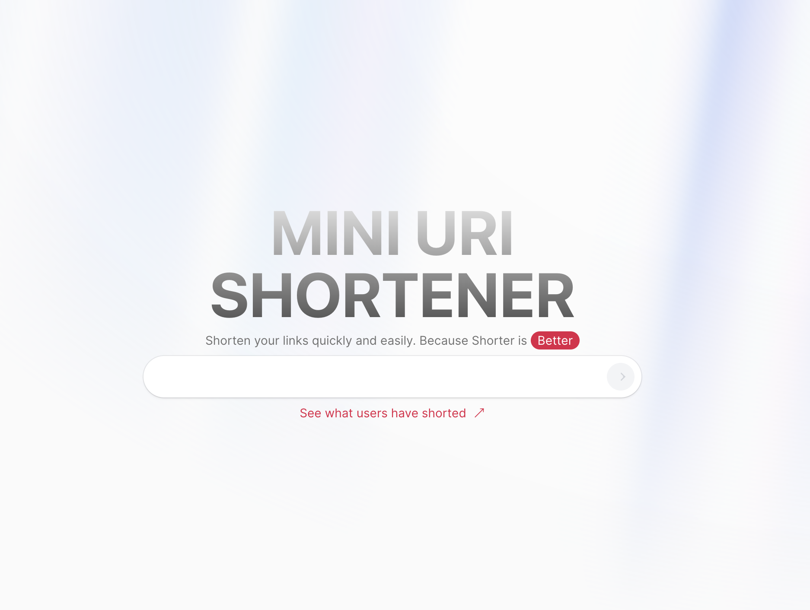

# Getting Started with URL Shortener

1. Clone the repository

   ```bash
    git clone https://github.com/mahmudulnayeem/url-shortner.git
   ```

2. Install dependencies

   ```bash
    bun install
   ```

3. Create a `.env.local` file in the root directory of the project and add the following environment variables

   ```js
   HOST_URL = http://localhost:3000
   MONGO_DB_CONNECTION_STRING = your_mongo_db_connection_string
   ```

4. Run the development server

   ```bash
    bun dev
   ```

   Open [http://localhost:3000](http://localhost:3000) with your browser to see the result.

## Learn More

To learn more about Next.js, take a look at the following resources:

- [Next.js Documentation](https://nextjs.org/docs) - learn about Next.js features and API.
- [Learn Next.js](https://nextjs.org/learn) - an interactive Next.js tutorial.

You can check out [the Next.js GitHub repository](https://github.com/vercel/next.js/) - your feedback and contributions are welcome!

## Deploy on Vercel

The easiest way to deploy your Next.js app is to use the [Vercel Platform](https://vercel.com/new?utm_medium=default-template&filter=next.js&utm_source=create-next-app&utm_campaign=create-next-app-readme) from the creators of Next.js.

Check out our [Next.js deployment documentation](https://nextjs.org/docs/deployment) for more details.

## Features

- Shorten URL
- Redirect to original URL
- View all shortened URLs
- Delete shortened URL
- Copy shortened URL
- View shortened URL details
- View shortened URL analytics
  <!-- - Copy shortened URL with custom slug -->
  <!-- - View shortened URL QR code -->

### Live preview

[URL Shortener↗](https://miniuri.vercel.app/)


